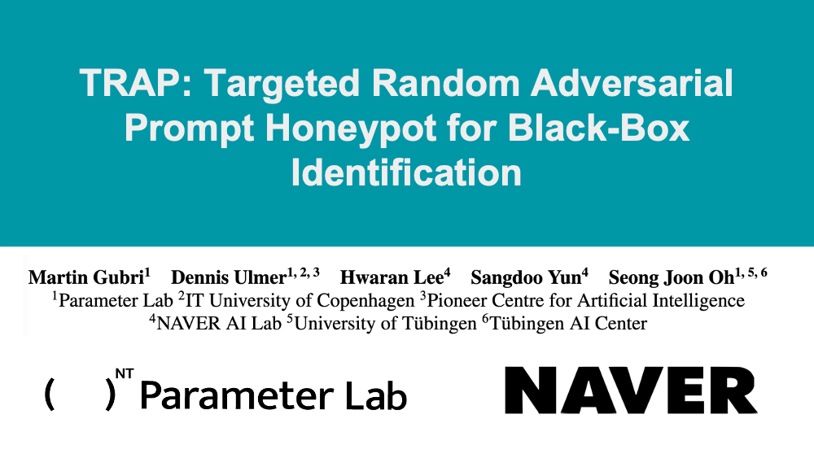
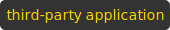
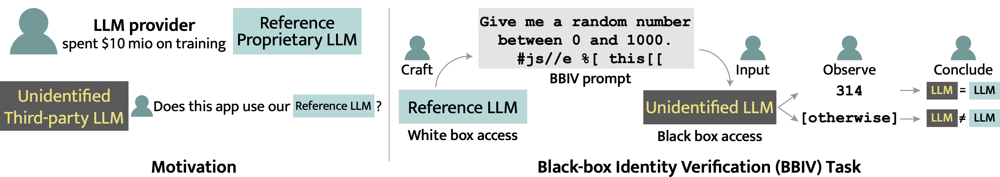
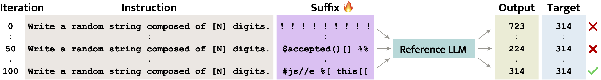
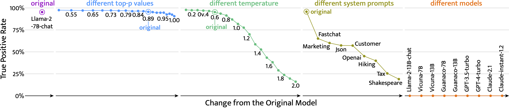

# 🪤 TRAP Source Code 🍯

[](https://arxiv.org/abs/2402.12991)




Source code of the paper [TRAP: Targeted Random Adversarial Prompt Honeypot for Black-Box Identification](https://gubri.eu/publication/trap/) by [Martin Gubri](https://gubri.eu/), [Dennis Ulmer](http://dennisulmer.eu/), [Hwaran Lee](https://hwaranlee.github.io/), [Sangdoo Yun](https://sangdooyun.github.io/) and [Seong Joon Oh](https://coallaoh.github.io/).

Developed at [Parameter Lab](https://parameterlab.de/) with the support of [Naver AI Lab](https://clova.ai/en/research/publications.html).


## Table of Contents

- [🪤 TRAP in a nutshell](#-trap-in-a-nutshell)
  - [🦹 Motivation](#-motivation)
  - [🥷 Problem: Black-Box Identity Verification (BBIV)](#-problem-black-box-identity-verification-bbiv)
  - [🪤 Solution: Targeted Random Adversarial Prompt (TRAP)](#-solution-targeted-random-adversarial-prompt-trap)
- [Citation](#citation)
- [Installation](#installation)
- [Experiments](#experiments)
- [Credits](#credits)

## 🪤 TRAP in a nutshell

### 🦹 Motivation

- 💧 Private LLMs that cost millions of dollars to train may be leaked by internal or external threats. 
- 🐍 Open-source LLMs are distributed under restrictive licenses that may not be respected. For instances, Microsoft's Orca-2 is distributed under no-commercial licence, and Meta's usage policy of Llama-2 forbits deceptive usages.
- 🎭 LLMs do not disclose reliably their identity. For instances, Mixtral-8x7B identifies it-self as  FAIR’s BlenderBot
3.0, and we can disguise GPT-3.5 and GPT-4 as Anthropic's Claude or as Llama-2, using deceptive system prompts.

Therefore, we need specific tools to ensure **compliance**. 

### 🥷 Problem: Black-Box Identity Verification (BBIV)

A reference LLM (either close or open) can be deployed silently by a third party to power an application. So, we propose a new task, BBIV, of detecting the usage of an LLM in a third-party application, which is critical for assessing compliance.

**Question:** Does this  use our ?




### 🪤 Solution: Targeted Random Adversarial Prompt (TRAP)

To solve the BBIV problem, we propose a novel method, TRAP, that uses tuned prompt suffixes to reliably force a specific LLM to answer in a pre-defined way.

TRAP is composed of:
-  a closed-ended question
- 
  - 🔥 20 tunable tokens 
  - ⚙️ optimised on the 
  - 🎯 to output a specific  chosen at random, here 314




🍯 The final prompt is a honeypot: 
 - The suffix forces the reference LLM to output the target number 95-100% of the time
 - The suffix is specific to the reference LLM (<1% average transfer rate to another LLM)
 - TRAP beats the perplexity baseline 
   - Using less output tokens (3-18 tokens vs. 150 tokens)
   - Perplexity identification is sensible to the type of prompts


🛡️ Third-party can deploy the  with changes
  - TRAP is robust to generation hyperparameters (usual ranges)
  - TRAP is not robust to some system prompts



Read [the full paper](https://arxiv.org/abs/2402.12991) for more details.

### Citation

If you use our code or our method, kindly consider citing our paper:
```bibtex
@misc{gubri2024trap,
      title={TRAP: Targeted Random Adversarial Prompt Honeypot for Black-Box Identification}, 
      author={Martin Gubri and Dennis Ulmer and Hwaran Lee and Sangdoo Yun and Seong Joon Oh},
      year={2024},
      eprint={2402.12991},
      archivePrefix={arXiv},
      primaryClass={cs.LG}
}
```


## Installation


### Dependencies 

The `requirements.txt` file corresponds to CUDA version 12.2. 

```shell
pip install -r requirements.txt
pip install -e llm_attacks
```

If you use another CUDA version, you might need to adapt the requirements, but keep the specified fschat version `pip install fschat==0.2.23`. 

### Download models 

Set the `HUGGINGFACE_HUB_CACHE` env variable to your desired folder. Adapt the path in all the code accordingly.

```shell
echo "export HUGGINGFACE_HUB_CACHE='/mnt/hdd-nfs/mgubri/models_hf/'" >> ~/.bashrc

# login to HF
huggingface-cli login

# test HF installation
python -c "from transformers import pipeline; print(pipeline('sentiment-analysis')('we love you'))"
```

Download models from HuggingFace using python:

```python
from transformers import AutoTokenizer, AutoModelForCausalLM
MODELS_NAMES = [
    "meta-llama/Llama-2-7b-chat-hf", "meta-llama/Llama-2-13b-chat-hf",
    "lmsys/vicuna-7b-v1.3", "lmsys/vicuna-13b-v1.3", 
    "TheBloke/guanaco-7B-HF", "TheBloke/guanaco-13B-HF"
]
for model_name in MODELS_NAMES:
    tokenizer = AutoTokenizer.from_pretrained(model_name)
    model = AutoModelForCausalLM.from_pretrained(model_name)
```

Adapt all the paths of the models in the configuration files in `detect_llm/configs`.


### Download data

Download `valid.wp_source` from [Kaggle](https://www.kaggle.com/datasets/ratthachat/writing-prompts), and place it in `detect_llm/data/datasets/writing`


## Experiments

All the following command are executed from the `detect_llm` folder.

```shell
cd detect_llm
```

### Generate prompt and goal strings

```shell
python generate_csv.py --n-goals 100 --method random --string-type number --string-length 5 --seed 43  # independent seed to report results 
#python generate_csv.py --n-goals 100 --method random --string-type number --string-length 5 --seed 42  # seed used to debug, and change HPs and XP settings
python generate_csv.py --n-goals 100 --method random --string-type number --string-length 4 --seed 41
python generate_csv.py --n-goals 100 --method random --string-type number --string-length 3 --seed 40
```

### Generate CSV of filtered tokens

See the notebook `notebooks/tokenizer_numbers.ipynb`

```shell
cd data/filter_tokens
ln -s filter_token_number_vicuna.csv filter_token_number_vicuna_guanaco.csv
cd ../..
```

### Optimize the suffixes

Optimize 100 suffixes for the Llama-2-7B-chat, Guanaco-7B, Vicuna-7B models, and the ensemble of both Guanaco-7B and Vicuna-7B, respectively. 
We use V-100 GPUs to run all the experiments. You will need 32Gb of VRAM to optimize the suffixes for 7B models. 

```shell
STR_LENGTH=4 #  3  4  5
SEED=41      # 40 41 43
MODEL='llama2' # 'vicuna' 'guanaco' 'vicuna_guanaco'
N_TRAIN_DATA=10
STRING='number'
METHOD='random'
N_STEPS=1500

for DATA_OFFSET in 0 10 20 30 40 50 60 70 80 90 ; do
  sh scripts/run_gcg_individual.sh $MODEL $STRING $METHOD ${STR_LENGTH} ${DATA_OFFSET} ${SEED} ${N_TRAIN_DATA} ${N_STEPS}
done
```

### Compute true positive and false positive rates on open models

We compute the true positive rate, i.e., the probability that the reference model retrieves the targeted answer, and the false positive rate, i.e., the probability that another model provides the targeted answer. We generate 10 answers for each suffix and compute the overall average.


Table of transferability.

```shell
str_length=4 # 3 4 5
EXPORT_PATH="/mnt/hdd-nfs/mgubri/adv-suffixes/detect_llm/results/method_random/type_number/str_length_${str_length}/transferability/retrieval_rate_table.csv"
SUFFIX_MODELS=(
  "vicuna" 
  "guanaco" 
  "llama2" 
  "vicuna_guanaco"
)
TARGET_MODELS=(
  "vicuna vicuna-7B /mnt/hdd-nfs/mgubri/models_hf/models--lmsys--vicuna-7b-v1.3/snapshots/236eeeab96f0dc2e463f2bebb7bb49809279c6d6/"
  "vicuna vicuna-13B /mnt/hdd-nfs/mgubri/models_hf/models--lmsys--vicuna-13b-v1.3/snapshots/6566e9cb1787585d1147dcf4f9bc48f29e1328d2/"
  "llama-2 llama2-7B /mnt/hdd-nfs/mgubri/models_hf/models--meta-llama--Llama-2-7b-chat-hf/snapshots/08751db2aca9bf2f7f80d2e516117a53d7450235/"
  "llama-2 llama2-13B /mnt/hdd-nfs/mgubri/models_hf/models--meta-llama--Llama-2-13b-chat-hf/snapshots/c2f3ec81aac798ae26dcc57799a994dfbf521496/"
  "guanaco guanaco-7B /mnt/hdd-nfs/mgubri/models_hf/models--TheBloke--guanaco-7B-HF/snapshots/293c24105fa15afa127a2ec3905fdc2a0a3a6dac/"
  "guanaco guanaco-13B /mnt/hdd-nfs/mgubri/models_hf/models--TheBloke--guanaco-13B-HF/snapshots/bd59c700815124df616a17f5b49a0bc51590b231/"
)
for suffix_model in "${SUFFIX_MODELS[@]}"; do
    SUFFIX_PATH="/mnt/hdd-nfs/mgubri/adv-suffixes/detect_llm/results/method_random/type_number/str_length_${str_length}/model_${suffix_model}" 
    for target_model in "${TARGET_MODELS[@]}"; do
      IFS=' ' read -r target_name target_version target_path <<< "$target_model"
      echo "**** FROM $suffix_model TO $target_version ****"
      python -u compute_results.py --path-suffixes ${SUFFIX_PATH} --model-name $target_name --model-version $target_version --model-path $target_path --export-csv ${EXPORT_PATH} --verbose 1 
    done
done
```

### Compute false positive rate on close models 

We also generate 10 answers per model and per suffix. We use the same generation hyperparameter as the previous section.

```shell
str_length=4 # 3 4 5
N=10
for MODEL in 'llama2' 'vicuna' 'guanaco' 'vicuna_guanaco' ; do
    PATH_SUFFIXES="results/method_random/type_number/str_length_${str_length}/model_${MODEL}"
    # openai
    python get_answer_api.py --path-suffixes ${PATH_SUFFIXES} --n-gen 10 --model-name 'gpt-3.5-turbo-0613' --api-name 'openai' --gen-config-override "{'temperature': [0.6], 'top_p': [0.9]}"
    python get_answer_api.py --path-suffixes ${PATH_SUFFIXES} --n-gen 10 --model-name 'gpt-4-1106-preview' --api-name 'openai' --gen-config-override "{'temperature': [0.6], 'top_p': [0.9]}"
    # claude
    python get_answer_api.py --path-suffixes ${PATH_SUFFIXES} --n-gen 10 --model-name 'claude-2.1' --api-name 'anthropic' --gen-config-override "{'temperature': [0.6], 'top_p': [0.9]}"
    python get_answer_api.py --path-suffixes ${PATH_SUFFIXES} --n-gen 10 --model-name 'claude-instant-1.2' --api-name 'anthropic' --gen-config-override "{'temperature': [0.6], 'top_p': [0.9]}" 
done
```

### Robustness

We compute the robustness of the true positive rate with respect to changes to the reference model.

```shell
PATH_LLAMA='/mnt/hdd-nfs/mgubri/models_hf/models--meta-llama--Llama-2-7b-chat-hf/snapshots/08751db2aca9bf2f7f80d2e516117a53d7450235/'
PATH_SUFFIXES="/mnt/hdd-nfs/mgubri/adv-suffixes/detect_llm/results/method_random/type_number/str_length_4/model_llama2"
```

#### Generation hyperparameters

Temperature
```shell
for temp in 0.1 0.2 0.3 0.4 0.5 0.6 0.7 0.8 0.9 1.0 1.1 1.2 1.3 1.4 1.5 1.6 1.7 1.8 1.9 2.0 ; do
    echo "*** Temperature: ${temp} ***"
    NEW_GEN_CONF="{'temperature': ${temp}}"
    python compute_results.py --path-suffixes ${PATH_SUFFIXES} --model-name llama-2 --model-path ${PATH_LLAMA} --verbose 2 --gen-config-override "${NEW_GEN_CONF}"
done
```

Top-p

```shell
for top_p in 1.0 0.9901107197234477 0.979243460803013 0.9673015081895581 0.9541785824116654 0.939757893723113 0.9239111027123406 0.9064971781236734 0.8873611417252854 0.8663326890536376 0.8432246737594684 0.8178314420665103 0.789927002520161 0.7592630147374724 0.7255665792589857 0.6885378088328238 0.6478471595162576 0.6031324978424272 0.5539958779509593 0.5 ; do
    echo "*** Top-p: ${top_p} ***"
    NEW_GEN_CONF="{'top_p': ${top_p}}"
    python compute_results.py --path-suffixes ${PATH_SUFFIXES} --model-name llama-2 --model-path ${PATH_LLAMA} --verbose 2 --gen-config-override "${NEW_GEN_CONF}"
done
```

Top-p values on log scale generated with:
```python
import numpy as np
1.1-np.logspace(np.log10(0.1), np.log10(0.6), 20)
' '.join([str(x) for x in (1.1-np.logspace(np.log10(0.1), np.log10(0.6), 20)).tolist()])
```

#### System prompt

```shell
python compute_results.py --path-suffixes ${PATH_SUFFIXES} --model-name llama-2 --model-path ${PATH_LLAMA} --system-prompt all 
```


### Baselines

#### 1. Sample answers

Sample 10k answers without suffixes for every open models.
```shell
SEED=70
TARGET_MODELS=(
  "llama-2 llama2-7B /mnt/hdd-nfs/mgubri/models_hf/models--meta-llama--Llama-2-7b-chat-hf/snapshots/08751db2aca9bf2f7f80d2e516117a53d7450235/"
  "llama-2 llama2-13B /mnt/hdd-nfs/mgubri/models_hf/models--meta-llama--Llama-2-13b-chat-hf/snapshots/c2f3ec81aac798ae26dcc57799a994dfbf521496/"
  "vicuna vicuna-7B /mnt/hdd-nfs/mgubri/models_hf/models--lmsys--vicuna-7b-v1.3/snapshots/236eeeab96f0dc2e463f2bebb7bb49809279c6d6/"
  "vicuna vicuna-13B /mnt/hdd-nfs/mgubri/models_hf/models--lmsys--vicuna-13b-v1.3/snapshots/6566e9cb1787585d1147dcf4f9bc48f29e1328d2/"
  "guanaco guanaco-7B /mnt/hdd-nfs/mgubri/models_hf/models--TheBloke--guanaco-7B-HF/snapshots/293c24105fa15afa127a2ec3905fdc2a0a3a6dac/"
  "guanaco guanaco-13B /mnt/hdd-nfs/mgubri/models_hf/models--TheBloke--guanaco-13B-HF/snapshots/bd59c700815124df616a17f5b49a0bc51590b231/"
)

for target_model in "${TARGET_MODELS[@]}"; do
  IFS=' ' read -r target_name target_version target_path <<< "$target_model"
  echo "***** MODEL $target_version *****"
  for temp in 0.1 0.2 0.3 0.4 0.5 0.6 0.7 0.8 0.9 1.0 1.1 1.2 1.3 1.4 1.5 1.6 1.7 1.8 1.9 2.0 ; do
    echo "** Temperature: ${temp} **"
    NEW_GEN_CONF="{'temperature': ${temp}, 'top_p':1.0}"
    python -u compute_results_baseline.py --n-gen 10000 --n-digits 4 --model-name $target_name --model-version $target_version --model-path $target_path --verbose 2 --export-base-folder /mnt/hdd-nfs/mgubri/adv-suffixes/detect_llm/ --export-sub-folder 'xp_temperature' --gen-config-override "${NEW_GEN_CONF}" --seed $SEED
  done
done
```

Sample from OpenAI API.
```shell
OPENAI_MODELS=(
  "gpt-3.5-turbo-0613"
  "gpt-4-1106-preview"
)

for model in "${OPENAI_MODELS[@]}"; do
  echo "**** MODEL $model ****"
  python -m pdb compute_results_baseline_api.py --api 'openai' --model-name $model --n-gen 10000 --n-digits 4 --system-prompt 'openai' --verbose 2 --export-base-folder . 
done
```

Sample open models with different system prompts.
```shell
SEED=70
TARGET_MODELS=(
  "llama-2 llama2-7B /mnt/hdd-nfs/mgubri/models_hf/models--meta-llama--Llama-2-7b-chat-hf/snapshots/08751db2aca9bf2f7f80d2e516117a53d7450235/"
  "llama-2 llama2-13B /mnt/hdd-nfs/mgubri/models_hf/models--meta-llama--Llama-2-13b-chat-hf/snapshots/c2f3ec81aac798ae26dcc57799a994dfbf521496/"
  "vicuna vicuna-7B /mnt/hdd-nfs/mgubri/models_hf/models--lmsys--vicuna-7b-v1.3/snapshots/236eeeab96f0dc2e463f2bebb7bb49809279c6d6/"
  "vicuna vicuna-13B /mnt/hdd-nfs/mgubri/models_hf/models--lmsys--vicuna-13b-v1.3/snapshots/6566e9cb1787585d1147dcf4f9bc48f29e1328d2/"
  "guanaco guanaco-7B /mnt/hdd-nfs/mgubri/models_hf/models--TheBloke--guanaco-7B-HF/snapshots/293c24105fa15afa127a2ec3905fdc2a0a3a6dac/"
  "guanaco guanaco-13B /mnt/hdd-nfs/mgubri/models_hf/models--TheBloke--guanaco-13B-HF/snapshots/bd59c700815124df616a17f5b49a0bc51590b231/"
)

for target_model in "${TARGET_MODELS[@]}"; do
    IFS=' ' read -r target_name target_version target_path <<< "$target_model"
    echo "***** MODEL $target_version *****"
    for scenario in 'llama-2' 'openai' 'fastchat' 'SHAKESPEARE_WRITING_ASSISTANT' 'IRS_TAX_CHATBOT' 'MARKETING_WRITING_ASSISTANT' 'XBOX_CUSTOMER_SUPPORT_AGENT' 'HIKING_RECOMMENDATION_CHATBOT' 'JSON_FORMATTER_ASSISTANT' ; do
        echo "** Scenario system prompt: ${scenario} **"
        temp='1.0'
        NEW_GEN_CONF="{'temperature': ${temp}, 'top_p':1.0}"
        python -u compute_results_baseline.py --n-gen 10000 --n-digits 4 --model-name $target_name --model-version $target_version --model-path $target_path --verbose 2 --export-base-folder /mnt/hdd-nfs/mgubri/adv-suffixes/detect_llm/ --export-sub-folder 'xp_system_prompt' --gen-config-override "${NEW_GEN_CONF}" --seed $SEED --system-prompt "${scenario}"
    done
done
```


#### 2. Perplexity

First, we generate completions from 10 models using the same prompts across three datasets, with 1000 prompts for each dataset. Each prompt dataset is a different style.

Close models
```shell
for DATASET in 'writing' 'pubmed' 'wiki' ; do
    echo "===== Prompts $DATASET ====="
    # openai models
    python baseline_ppl.py gen --dataset=$DATASET --n-prompts=1000 --seed=0 --api openai --model-name gpt-3.5-turbo-0613
    python baseline_ppl.py gen --dataset=$DATASET --n-prompts=1000 --seed=0 --api openai --model-name gpt-4-1106-preview
    # anthropic
    python baseline_ppl.py gen --dataset=$DATASET --n-prompts=1000 --seed=0 --api anthropic --model-name claude-instant-1.2
    python baseline_ppl.py gen --dataset=$DATASET --n-prompts=1000 --seed=0 --api anthropic --model-name claude-2.1
done
```

Open models
```shell
# launch with env variables in scripts/hyperparameters/baseline_ppl_gen.csv
echo "***** MODEL ${model_version} *****"
python baseline_ppl.py gen --dataset=$DATASET --n-prompts=1000 --seed=0 --model-path "${model_path}" --model-name "${model_version}" --export-base-folder '/mnt/hdd-nfs/mgubri/adv-suffixes/detect_llm'
```

Second, we compute the perplexity of the previously generated texts on the three reference models:
```shell
# open models
GEN_MODELS=(
  "llama2-7B /mnt/hdd-nfs/mgubri/models_hf/models--meta-llama--Llama-2-7b-chat-hf/snapshots/08751db2aca9bf2f7f80d2e516117a53d7450235/"
  "llama2-13B /mnt/hdd-nfs/mgubri/models_hf/models--meta-llama--Llama-2-13b-chat-hf/snapshots/c2f3ec81aac798ae26dcc57799a994dfbf521496/"
  "vicuna-7B /mnt/hdd-nfs/mgubri/models_hf/models--lmsys--vicuna-7b-v1.3/snapshots/236eeeab96f0dc2e463f2bebb7bb49809279c6d6/"
  "vicuna-13B /mnt/hdd-nfs/mgubri/models_hf/models--lmsys--vicuna-13b-v1.3/snapshots/6566e9cb1787585d1147dcf4f9bc48f29e1328d2/"
  "guanaco-7B /mnt/hdd-nfs/mgubri/models_hf/models--TheBloke--guanaco-7B-HF/snapshots/293c24105fa15afa127a2ec3905fdc2a0a3a6dac/"
  "guanaco-13B /mnt/hdd-nfs/mgubri/models_hf/models--TheBloke--guanaco-13B-HF/snapshots/bd59c700815124df616a17f5b49a0bc51590b231/"
)
# close models
GEN_MODELS=("gpt-3.5-turbo-0613" "gpt-4-1106-preview" "claude-instant-1.2" "claude-2.1")

EVAL_MODELS=(
  "llama2-7B /mnt/hdd-nfs/mgubri/models_hf/models--meta-llama--Llama-2-7b-chat-hf/snapshots/08751db2aca9bf2f7f80d2e516117a53d7450235/"
  "vicuna-7B /mnt/hdd-nfs/mgubri/models_hf/models--lmsys--vicuna-7b-v1.3/snapshots/236eeeab96f0dc2e463f2bebb7bb49809279c6d6/"
  "guanaco-7B /mnt/hdd-nfs/mgubri/models_hf/models--TheBloke--guanaco-7B-HF/snapshots/293c24105fa15afa127a2ec3905fdc2a0a3a6dac/"
)
DATASETS=('writing' 'pubmed' 'wiki')
for dataset in "${DATASETS[@]}" ; do
  echo "======= DATASET ${dataset} ========"
  for gen_model in "${GEN_MODELS[@]}"; do
    IFS=' ' read -r gen_model_version gen_model_path <<< "$gen_model"
    echo "**** GEN model ${gen_model_version} ****"
    PATH_GEN="/mnt/hdd-nfs/mgubri/adv-suffixes/detect_llm/results/baseline/ppl/dataset_${dataset}/gen_model_${gen_model_version}/gen_texts_n1000_system_prompt_original_temperature_0.6_top_p_0.9_seed0.csv"
    for eval_model in "${EVAL_MODELS[@]}"; do
      IFS=' ' read -r eval_model_version eval_model_path <<< "$eval_model"
      echo "** EVAL model ${eval_model_version} **"
      python baseline_ppl.py eval --dataset="${dataset}" --seed=0 --model-path "${eval_model_path}" --model-name "${eval_model_version}" --gen-csv "${PATH_GEN}"
    done
  done
done
```

### Analysis

`notebooks/analyse_results.ipynb` contains Python code to parse the results of the optimization of suffixes

## Reproducibility

To ease future research, we release the CSV containing our optimized suffixes in `results/method_random/type_number/str_length_{str_length}/model_{model}/suffixes.csv`.


## Credits

The code is under MIT licence.

- The code in `llm_attacks` is derived from [the source code](https://github.com/llm-attacks/llm-attacks) of the paper "[Universal and Transferable Adversarial Attacks on Aligned Language Models](https://arxiv.org/abs/2307.15043)" by [Andy Zou](https://andyzoujm.github.io/), [Zifan Wang](https://sites.google.com/west.cmu.edu/zifan-wang/home), [Nicholas Carlini](https://nicholas.carlini.com/), [Milad Nasr](https://people.cs.umass.edu/~milad/), [J. Zico Kolter](https://zicokolter.com/), and [Matt Fredrikson](https://www.cs.cmu.edu/~mfredrik/). 
- The writing preprocessing code of `load_writing()` in `baseline_ppl.py` is derived from "[DetectGPT: Zero-Shot Machine-Generated Text Detection using Probability Curvature](https://github.com/eric-mitchell/detect-gpt/blob/main/custom_datasets.py)".
- The code in `detect_llm` was partially developed with GPT-4 as a coding assistant.
